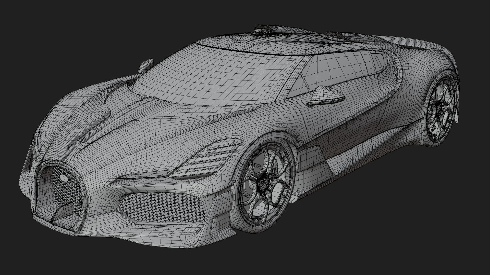
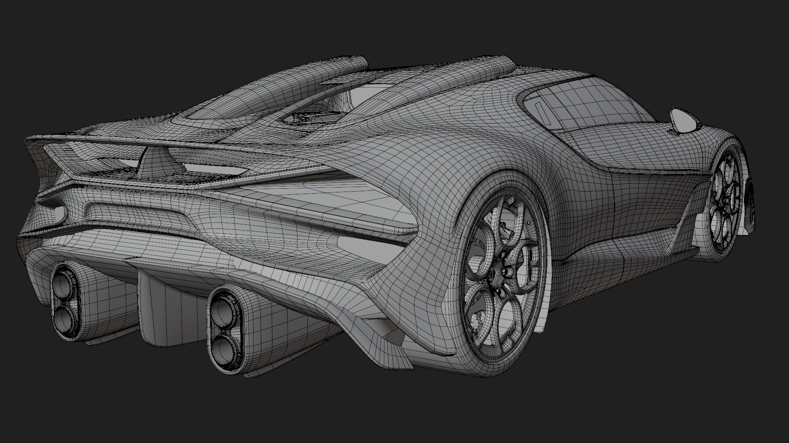

BUGATTI BROUILLARD — 3D MODEL

<table>
<tr>
<td></td>
<td></td>
</tr>
</table>

Overview

A detailed 3D model of the Bugatti Brouillard, modeled and refined in Blender over approximately 60 hours.

The project was developed using the Bugatti W16 Mistral as a reference for the basic proportions and forms, combined with reference images collected from the internet and Pinterest.

I used those references to study the Brouillard’s shapes and details, then progressively built and refined the exterior of the vehicle.

<table>
<tr>
<td></td>
<td></td>
</tr>
</table>

Modeling Process

I started from the front bumper and gradually worked around the vehicle, first establishing the main body before moving into the smaller exterior details.

* Main Body: Built the main exterior body and shaped it around the required openings, cutouts, and surface transitions.
* Front End: Refined the front bumper, front bodywork, headlights, and front aerodynamic surfaces.
* Rear Section: Built the rear bodywork and added the fixed ducktail rear wing, which forms an important part of the Brouillard’s aerodynamic design. (Bugatti Newsroom)
* Headlights & Taillights: Modeled the front headlights and rear lighting assemblies and refined their surrounding bodywork.
* Windshield: Created the windshield and refined the surrounding roof and body surfaces.
* Exhaust System: Modeled the four exhaust outlets at the rear and built the surrounding bodywork around them.
* Side Mirrors: Added and refined the exterior mirrors.
* Engine Cover: Modeled the rear engine cover and added the W16, Bugatti, and 1600 logos as mesh details.
* Roof Air Intakes: Added the two roof-mounted air intakes that feed air toward the W16 engine. (Bugatti Newsroom)
* Front Grille: Created the iconic Bugatti horseshoe grille as 3D mesh and integrated it into the front bodywork. (Bugatti Newsroom)
* Rear Grilles: Created the rear grille elements using 2D planes to reproduce the appearance of the fine mesh surfaces.
* Wheels & Rims: Added the wheels and rims and refined their overall appearance.
* Brakes: Added brake discs and brake calipers, adapting brake components from my previous Bugatti Destrier project.
* Additional Details: Added smaller exterior components, logos, text, surface details, and other elements before carrying out further refinement and adjustments.

<table>
<tr>
<td></td>
<td></td>
<td></td>
</tr>
</table>

Materials & Textures

After completing the main geometry, I developed the materials and textures for the exterior.

This included the vehicle’s paint, carbon and metallic components, wheels, brakes, grilles, logos, text, and other exterior details.

The Bugatti, W16, and 1600 branding was also integrated into the model using mesh-based details and textures.

The materials and geometry were continuously refined together to improve the overall appearance of the finished model.

<table>
<tr>
<td></td>
</tr>
</table>

Exterior Focus

The project focused entirely on the exterior of the Bugatti Brouillard.

The interior was not modeled, with the project instead concentrating on achieving a detailed and refined exterior that captures the overall shape, proportions, aerodynamic elements, and visual character of the vehicle.

<table>
<tr>
<td></td>
</tr>
</table>

Final Model

<table>
  <tr>
    <td></td>
    <td></td>
  </tr>
</table>

The completed model was uploaded to Sketchfab for an interactive 3D presentation.

3D Model: [View the BUGATTI BROUILLARD on Sketchfab](https://sketchfab.com/3d-models/bugatti-brouillard-f6331807656f4bb0ade1227a0cdf7130)

Project Info

* Software: Blender
* Project Type: 3D Vehicle Model
* Model: Bugatti Brouillard
* Focus: Exterior Modeling, Detailing & Texturing
* Reference: Bugatti W16 Mistral + Internet & Pinterest References
* Time Spent: ~60 hours
* Interior: Not modeled
* Status: Completed
